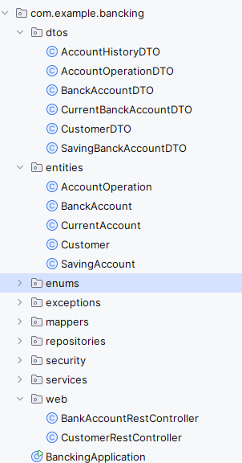

# Digital Banking Application

A comprehensive digital banking application built with **Spring Boot** (Backend) and **Angular** (Frontend), featuring JWT authentication and role-based access control.

##  Project Overview

This application provides a complete digital banking solution that allows managing bank accounts, customers, and operations. Each account belongs to a customer and can have multiple operations (DEBIT/CREDIT). The system supports two types of accounts: Current Accounts and Savings Accounts.

##  Features Implemented

### Backend (Spring Boot)
- **JPA Entities**: Customer, BankAccount, SavingAccount, CurrentAccount, AccountOperation
- **Spring Data JPA Repositories** for data persistence
- **RESTful Web Services** with comprehensive CRUD operations
- **API Documentation** with Swagger/OpenAPI 3
- **Service Layer** with DTOs for clean architecture
- **JWT Authentication** with Spring Security and InMemoryUserDetailsManager
- **Role-based Access Control** with predefined users:
  - `admin` (USER + ADMIN authorities)
  - `user1` (USER authority only)

##  Technologies Used

### Backend
- **Java**
- **Spring Boot**
- **Spring Security** (JWT Authentication)
- **Spring Data JPA**
- **MySQL/H2 Database**
- **Maven** (Build Tool)
- **Swagger/OpenAPI 3** (API Documentation)

### Security Implementation
- **InMemoryUserDetailsManager**: Predefined users for demonstration
- **JWT with HS512**: Secure token generation and validation
- **Method-level Security**: `@PreAuthorize` annotations on endpoints
- **Stateless Authentication**: No server-side sessions
- **CORS Support**: Configured for Angular frontend integration

## Project Structure
  

###  `application.properties`
```java
spring.application.name=bancking
spring.datasource.url=jdbc:h2:mem:bank
spring.datasource.username=sa
spring.datasource.password=
spring.h2.console.enabled=true
spring.h2.console.path=/h2-console
server.port=8085
#spring.datasource.url=jdbc:mysql://localhost:3306/bank-db?createDatabaseIfNotExist=true
#spring.datasource.username=root
#spring.datasource.password=
#spring.jpa.hibernate.ddl-auto=update
#spring.jpa.show-sql=true
#spring.jpa.properties.hibernate.dialect=org.hibernate.dialect.MariaDBDialect
jwt.secret=8043271593602749185036214972058374162905837412609481756328094716503
```
### Entities
- **Customer**: Customer information and details
- **BankAccount**: Abstract account entity
- **CurrentAccount**: Current account with overdraft
- **SavingAccount**: Savings account with interest rate
- **AccountOperation**: Transaction records (DEBIT/CREDIT)

### Repositories
```java
public interface AccountOperationRepository extends JpaRepository<AccountOperation,Long> {

    public List<AccountOperation> findByBanckAccountId(String accountId);
    public Page<AccountOperation> findByBanckAccountId(String accountId, Pageable pageable);
}
```
```java
public interface BankAccountRepository extends JpaRepository<BanckAccount,String> {
}
```
```java
public interface CustomerRepository extends JpaRepository<Customer,Long> {
    @Query("select c from Customer c where c.name like :kw")

    List<Customer> searchCustomers(@Param("kw") String keyword);
}
```
### dtos
DTOs for clean architecture
#### AccountHistoryDTO
```java
@Data
public class AccountHistoryDTO {
   private String accountId;
    private double balance;
    private  int currentPage;
    private int totalPages;
    private int  pageSize;
    private List<AccountOperationDTO> accountOperationDTOS;
}
```
#### AccountOperationDTO
```java
@Data
public class AccountOperationDTO {
    private Long id;
    private Date operationDate;
    private double amount;
    private OperationType type;
private String description;
}
```
#### CurrentBanckAccountDTO
```java
@Data

public class CurrentBanckAccountDTO extends  BanckAccountDTO {
    private String id;
    private double balance;
    private Date createdAt;
    private AccountStatus status;
    private CustomerDTO customerDTO;
    private double overDraft;


}
```
#### CustomerDTO
```java
@Data
public class CustomerDTO {
    private  Long id;
    private  String name;
    private  String email;

}
```
#### SavingBanckAccountDTO
```java
@Data
public class SavingBanckAccountDTO extends  BanckAccountDTO {
    private String id;
    private double balance;
    private Date createdAt;
    private AccountStatus status;
    private CustomerDTO customerDTO;
    private double interstRate;
}
```

### services
The service layer implements the business logic of the banking application and serves as an intermediary between REST controllers and repositories.
####  `BankAccountService` Interface
```java
public interface BankAccountService {
  CustomerDTO saveCustomer(CustomerDTO customerDTO);
   CurrentBanckAccountDTO saveCurrentBankAccount (double initialBalance, double overDraft, Long customerId) throws CustomerNotFoundException;
 SavingBanckAccountDTO saveSavingBankAccount (double initialBalance, double interestRate, Long customerId) throws CustomerNotFoundException;
   List<CustomerDTO> listCustomer();
   BanckAccountDTO getBankAccuount (String accountId) throws BankAccountNotFoundException;
   void debit(String accountId,double amount,String description) throws BankAccountNotFoundException, BalanceNotSufficientException;
    void credit(String accountId,double amount,String description) throws BankAccountNotFoundException;
    void transfer(String accountIdSource,String accountIdDestinattion,double amount ) throws BankAccountNotFoundException, BalanceNotSufficientException;
 List<BanckAccountDTO> listBankAccount();

 CustomerDTO getCustomer(Long id) throws CustomerNotFoundException;

 CustomerDTO updateCustomer(CustomerDTO customerDTO);

 void deletCustomer(Long customerId);

 List<AccountOperationDTO> accountHistory(String accountId);

 AccountHistoryDTO  getAccountHistory(String accountId, int page, int size) throws BankAccountNotFoundException;

    List<CustomerDTO> searchCustomers(String keyword);
}
```
#### Service Functionalities
**Customer Management**
- `saveCustomer()`: Creates a new customer with data validation
- `getCustomer()`: Retrieves a customer by their ID
- `updateCustomer()`: Updates existing customer information
- `deleteCustomer()`: Deletes a customer (with associated accounts verification)
- `listCustomer()`: Lists all customers
- `searchCustomers()`: Searches customers by keyword (name, email)

**Bank Account Management**
- `saveCurrentBankAccount()`: Creates a current account with overdraft facility
- `saveSavingBankAccount()`: Creates a savings account with interest rate
- `getBankAccount()`: Retrieves an account by its ID
- `listBankAccount()`: Lists all bank accounts

**Banking Operations**
- `debit()`: Debits an account with sufficient balance verification
- `credit()`: Credits an account (adds funds)
- `transfer()`: Transfers money between two accounts with balance validation

**History and Consultation**
- `accountHistory()`: Complete operation history of an account
- `getAccountHistory()`: Paginated history with pagination management

#### Exception Handling
The service handles three types of custom exceptions:
- **`CustomerNotFoundException`**: Thrown when a customer doesn't exist
- **`BankAccountNotFoundException`**: Thrown when a bank account doesn't exist  
- **`BalanceNotSufficientException`**: Thrown during debit operations with insufficient balance
### Web Controllers
The web layer provides RESTful endpoints for the banking application, implementing secure API access with role-based authorization.
#### BankAccountRestController
```java

package com.example.bancking.web;

import com.example.bancking.dtos.AccountHistoryDTO;
import com.example.bancking.dtos.AccountOperationDTO;
import com.example.bancking.dtos.BanckAccountDTO;
import com.example.bancking.exceptions.BankAccountNotFoundException;
import com.example.bancking.services.BankAccountService;
import lombok.AllArgsConstructor;
import org.springframework.web.bind.annotation.*;

import java.util.List;
@CrossOrigin( "*")

@RestController
@AllArgsConstructor
public class BankAccountRestController {
    private BankAccountService bankAccountService;
@GetMapping("/accounts/{accountId}")
  public BanckAccountDTO getBankAccount(@PathVariable String accountId) throws BankAccountNotFoundException {
    BanckAccountDTO banckAccountDTO=bankAccountService.getBankAccuount(accountId);
return banckAccountDTO;
  }
@GetMapping("/accounts")
    public List<BanckAccountDTO> listAccounts(){
    return bankAccountService.listBankAccount();
}
@GetMapping("/accounts/{accountId}/operations")
public  List<AccountOperationDTO> getHistory(@PathVariable String accountId){
    return bankAccountService.accountHistory(accountId);
}
    @GetMapping("/accounts/{accountId}/pageOperations")
    public AccountHistoryDTO getAccountHistory(@PathVariable String accountId ,
                                               @RequestParam(name = "page",defaultValue="0") int page,
                                               @RequestParam(name = "size",defaultValue="0") int size) throws BankAccountNotFoundException {
        return bankAccountService.getAccountHistory(accountId,page,size);
    }
}
```
#### CustomerRestController
```java
package com.example.bancking.web;

import com.example.bancking.dtos.CustomerDTO;
import com.example.bancking.entities.Customer;
import com.example.bancking.exceptions.CustomerNotFoundException;
import com.example.bancking.services.BankAccountService;
import lombok.AllArgsConstructor;
import lombok.extern.slf4j.Slf4j;
import org.springframework.security.access.prepost.PreAuthorize;
import org.springframework.web.bind.annotation.*;

import java.util.List;
@CrossOrigin( "*")

@RestController
@AllArgsConstructor
@Slf4j
public class CustomerRestController {
    private BankAccountService bankAccountService;
    @GetMapping("/customers")
    @PreAuthorize("hasAuthority('USER')")
    public List<CustomerDTO> customers(){
        return bankAccountService.listCustomer();
    }
    @GetMapping("/customers/search")
    @PreAuthorize("hasAuthority('USER')")

    public List<CustomerDTO> searchCustomers(@RequestParam(name = "keyword",defaultValue = "")String keyword){
        return bankAccountService.searchCustomers("%"+keyword+"%");
    }
@GetMapping("/customers/{id}")
@PreAuthorize("hasAuthority('USER')")

    public CustomerDTO getCustomer( @PathVariable(name = "id") Long customerId) throws CustomerNotFoundException {
return  bankAccountService.getCustomer(customerId);
}

    @PostMapping("/customers")
    @PreAuthorize("hasAuthority('ADMIN')")

    public CustomerDTO saveCustomer(@RequestBody CustomerDTO customerDTO )  {
        return  bankAccountService.saveCustomer(customerDTO);
    }
@PutMapping ("/customers/{customerId}")
@PreAuthorize("hasAuthority('ADMIN')")

    public CustomerDTO updateCustomer(@PathVariable Long customerId,@RequestBody CustomerDTO customerDTO){
        customerDTO.setId(customerId);
        return bankAccountService.updateCustomer(customerDTO);
}
@DeleteMapping ("/customers/{customerId}")
@PreAuthorize("hasAuthority('ADMIN')")

    public void deletCustomer(@PathVariable Long customerId){
        bankAccountService.deletCustomer(customerId);
}
}

```
### Security
The security layer implements JWT-based authentication with role-based authorization using Spring Security.
#### SecurityConfig
```java

@Configuration
@EnableWebSecurity
@EnableMethodSecurity(prePostEnabled = true)
public class SecurityConfig {
    @Value("${jwt.secret}")
    private String secretKey;
    @Bean
    public InMemoryUserDetailsManager inMemoryUserDetailsManager(){

        PasswordEncoder passwordEncoder=passwordEncoder();
        return  new InMemoryUserDetailsManager(
                User.withUsername("user1").password(passwordEncoder.encode("12345")).authorities("USER").build(),
                User.withUsername("admin").password(passwordEncoder.encode("12345")).authorities("USER","ADMIN").build()

                );

    }

    @Bean
    public  PasswordEncoder passwordEncoder(){
        return new BCryptPasswordEncoder();
    }

@Bean
    public SecurityFilterChain securityFilterChain(HttpSecurity httpSecurity) throws Exception{
        return httpSecurity
                .sessionManagement(sm->sm.sessionCreationPolicy(SessionCreationPolicy.STATELESS))
                .csrf(csrf->csrf.disable())
                .cors(Customizer.withDefaults())
                .headers(headers -> headers.frameOptions(frameOptions -> frameOptions.disable()))                .authorizeHttpRequests(ar->ar.requestMatchers("/auth/login/**","/h2-console/**").permitAll())
                .authorizeHttpRequests(ar->ar.anyRequest().authenticated())
                //.httpBasic(Customizer.withDefaults())
                .oauth2ResourceServer(oa ->
                        oa.jwt(jwt -> jwt.jwtAuthenticationConverter(jwtAuthenticationConverter())))                .build();

}
@Bean
    JwtEncoder jwtEncoder(){

        return  new NimbusJwtEncoder(new ImmutableSecret<>(secretKey.getBytes()));
}
    @Bean
    JwtDecoder jwtDecoder(){
        SecretKeySpec secretKeySpec=new SecretKeySpec(secretKey.getBytes(),"RSA");
        return   NimbusJwtDecoder.withSecretKey(secretKeySpec).macAlgorithm(MacAlgorithm.HS512).build();
    }
    @Bean
    public AuthenticationManager authenticationManager(UserDetailsService userDetailsService){
        DaoAuthenticationProvider daoAuthenticationProvider=new DaoAuthenticationProvider();
        daoAuthenticationProvider.setPasswordEncoder(passwordEncoder());
        daoAuthenticationProvider.setUserDetailsService(userDetailsService);
    return new ProviderManager(daoAuthenticationProvider);
    }
@Bean
    CorsConfigurationSource corsConfigurationSource(){
    CorsConfiguration corsConfiguration=new CorsConfiguration();
    corsConfiguration.addAllowedOrigin("*");
    corsConfiguration.addAllowedMethod("*");
    corsConfiguration.addAllowedHeader("*");
    UrlBasedCorsConfigurationSource source=new UrlBasedCorsConfigurationSource();
    source.registerCorsConfiguration("/**",corsConfiguration);
    return source;
}
    @Bean
    public JwtAuthenticationConverter jwtAuthenticationConverter() {
        JwtGrantedAuthoritiesConverter grantedAuthoritiesConverter = new JwtGrantedAuthoritiesConverter();
        grantedAuthoritiesConverter.setAuthorityPrefix("");
        grantedAuthoritiesConverter.setAuthoritiesClaimName("scope");

        JwtAuthenticationConverter jwtAuthenticationConverter = new JwtAuthenticationConverter();
        jwtAuthenticationConverter.setJwtGrantedAuthoritiesConverter(grantedAuthoritiesConverter);
        return jwtAuthenticationConverter;
    }

}


```
#### SecurityController
```java
@RestController
@RequestMapping("/auth")
public class SecurityController {
    @Autowired
    private AuthenticationManager authenticationManager;
    @Autowired
    private JwtEncoder jwtEncoder;
    @GetMapping("/profile")
    public Authentication authentication(Authentication authentication){
        return authentication;
    }
    @PostMapping("/login")
    public Map<String,String> login(String username, String password){
 Authentication authentication= authenticationManager.authenticate(new UsernamePasswordAuthenticationToken(username,password));
        Instant instant=Instant.now();
        String scope=authentication.getAuthorities().stream().map(GrantedAuthority::getAuthority).collect(Collectors.joining(" "));
        JwtClaimsSet jwtClaimsSet= JwtClaimsSet.builder()
                .issuedAt(instant)
                .expiresAt(instant.plus(10, ChronoUnit.MINUTES))
                .subject(username)
                .claim("scope",scope)
                .build();
        JwtEncoderParameters jwtEncoderParameters=JwtEncoderParameters.from(
                JwsHeader.with(MacAlgorithm.HS512).build(),jwtClaimsSet
        );
        String jwt=jwtEncoder.encode(jwtEncoderParameters).getTokenValue();

 return Map.of("access-token",jwt);
    }
}

```
#### Security Features

**JWT Configuration**
- **Algorithm**: HS512 (HMAC with SHA-512)
- **Token Expiration**: 10 minutes
- **Secret Key**: Configurable via `application.properties`
- **Stateless**: No server-side session storage

**User Management**
- **InMemoryUserDetailsManager**: Predefined users for demonstration
- **Password Encoding**: BCrypt hashing algorithm
- **Predefined Users**:
  - `user1`: Password `12345`, Authority `USER`
  - `admin`: Password `12345`, Authorities `USER`, `ADMIN`

**Authorization Configuration**
- **Method-level Security**: `@EnableMethodSecurity(prePostEnabled = true)`
- **Public Endpoints**: `/auth/login/**`, `/h2-console/**`
- **Protected Endpoints**: All other endpoints require authentication
- **Role-based Access**: Different authorities for different operations

#### Authentication Flow

1. **Login Request**: Client sends username/password to `/auth/login`
2. **Authentication**: Spring Security validates credentials
3. **JWT Generation**: Server creates JWT with user authorities
4. **Token Response**: Client receives JWT token
5. **Subsequent Requests**: Client includes JWT in Authorization header
6. **Token Validation**: Server validates JWT and extracts authorities

#### CORS Configuration

**Cross-Origin Resource Sharing**
- Allows all origins (`*`)
- Permits all HTTP methods
- Accepts all headers
- Essential for Angular frontend integration

####  Security Components

**Key Beans Configuration**
- `JwtEncoder`: Encodes JWT tokens using secret key
- `JwtDecoder`: Decodes and validates JWT tokens
- `AuthenticationManager`: Handles authentication process
- `PasswordEncoder`: BCrypt password hashing
- `CorsConfigurationSource`: CORS policy configuration

##  Authentication & Authorization

### User Roles & Permissions

#### **ADMIN User (`admin`)**
-  **READ**: View all customers
-  **CREATE**: Add new customers  
-  **UPDATE**: Edit existing customers
-  **DELETE**: Remove customers
-  **SEARCH**: Search customers

#### **USER Role (`user1`)**
-  **READ**: View all customers
-  **SEARCH**: Search customers


